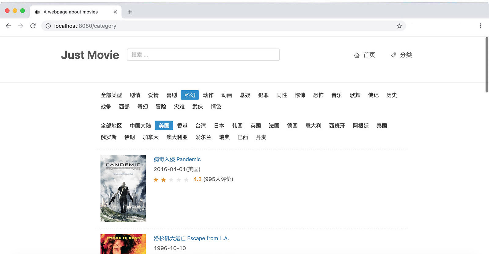

# Just-Movies

从 `films.json` 文件中解析出电影信息并在页面上显示。

## Usage

```bash
git clone https://github.com/Renovamen/Just-Movies.git

# install dependencies
npm install

# serve with hot reload at localhost:8080
npm run dev
```

浏览器访问 [http://localhost:8080](http://localhost:8080/)


## Structure

```‘
├── src
│   ├── App.vue                          // 入口页面
│   ├── components                       // 组件
│   │   ├── Banner.vue                   // banner 组件
│   │   ├── MovieListItem.vue            // 分类页电影列表中的每个电影
│   │   └── SearchListMovieItem.vue      // 搜索栏下拉列表
│   ├── main.js                          // 入口，加载组件、初始化等
│   ├── pages                            // 页面
│   │   ├── CategoryPage.vue             // 分类页
│   │   ├── Home.vue                     // 首页
│   │   └── movie-detail                 // 电影详情
│   │       ├── MovieDetail.vue          // 详情页
│   │       ├── MovieIntroduction.vue    // 介绍（导演、编剧、演员等）区域
│   │       └── MovieRate.vue            // 评分区域
│   ├── router                           // 路由
│   └── utils.js                         // 工具（json 解析等）
└── static                               // 静态文件（films.json等）
```


## Requirments

- [Vue](https://github.com/vuejs/vue)
- [vue-router](https://github.com/vuejs/vue-router)
- [axios](https://github.com/axios/axios)
- [ant-design-vue](https://github.com/vueComponent/ant-design-vue)：UI 组件库
- [stylus](https://github.com/stylus/stylus)：CSS 预编译器


## Screenshots

### Home Page


### Category Page




### Movie Detail Page


### Search


