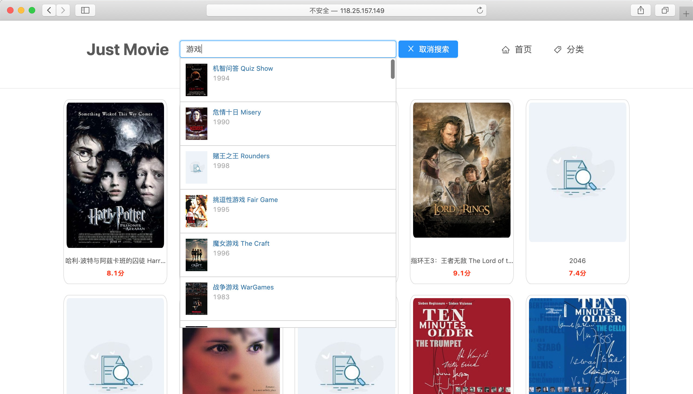
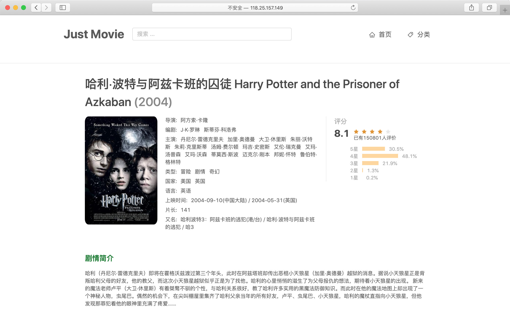

# Just Movies

Django + Vue 实现的电影 Web 应用。

&nbsp;

## Preview

https://renovamen.github.io/Just-Movies/

（因为应付交作业的服务器只租了一个月，所以演示页是直接从 json 文件中读取数据的[纯前端版本](https://github.com/Renovamen/Just-Movies/tree/gh-pages)...

&nbsp;

## Environment

- Vue 2.9.6
- Django 2.1.1
- Python 3.6.7

&nbsp;

## Requirments

### Frontend

- [Vue](https://github.com/vuejs/vue)
- [vue-router](https://github.com/vuejs/vue-router)：路由管理
- [axios](https://github.com/axios/axios)：请求数据
- [ant-design-vue](https://github.com/vueComponent/ant-design-vue)：UI 组件库
- [stylus](https://github.com/stylus/stylus)：CSS 预编译器

### Backend

- [Django](https://github.com/django/django)
- [Django REST framework](https://github.com/encode/django-rest-framework)：构建 Web API
- [django-cors-headers](https://github.com/ottoyiu/django-cors-headers)：跨域

### Database

- sqlite3

### Set Up

- [uWSGI](https://github.com/unbit/uwsgi)
- Nginx

&nbsp;

## Structure

```
├── backend
│   ├── Just_Movies
│   │   ├── __init__.py
│   │   ├── wsgi.py
│   │   ├── settings.py                      // 项目配置
│   │   └── urls.py                          // 项目路由配置
│   ├── movies
│   │   ├── __init__.py
│   │   ├── admin.py
│   │   ├── apps.py
│   │   ├── models.py                        // 模型
│   │   ├── serializer.py                    // 序列化
│   │   ├── urls.py                          // 子应用路由配置
│   │   └── views.py                         // 视图
│   ├── dist                                 // 打包好的 Vue 模板
│   ├── manage.py
│   ├── requirements.txt                     // 后端依赖
│   ├── json-to-database.py                  // 把 json 中的数据导入数据库
│   ├── movies.sqlite3                       // 存储电影数据的数据库
│   └── films_all.json                       // 存储电影数据的 json 文件
├── frontend
│   ├── build
│   ├── config
│   ├── index.html
│   ├── package.json
│   ├── src
│   │   ├── App.vue                          // 入口页面
│   │   ├── components                       // 组件
│   │   │   ├── Banner.vue                   // banner 组件
│   │   │   ├── MovieListItem.vue            // 分类页电影列表中的每个电影
│   │   │   └── SearchListMovieItem.vue      // 搜索栏下拉列表
│   │   ├── main.js                          // 入口，加载组件、初始化等
│   │   ├── pages                            // 页面
│   │   │   ├── CategoryPage.vue             // 分类页
│   │   │   ├── Home.vue                     // 首页
│   │   │   └── movie-detail                 // 电影详情
│   │   │       ├── MovieDetail.vue          // 详情页
│   │   │       ├── MovieIntroduction.vue    // 介绍（导演、编剧、演员等）区域
│   │   │       └── MovieRate.vue            // 评分区域
│   │   └── router                           // 路由
│   └── static                               // 静态文件（图片、films.json 等）
└── script
    └── uwsgi.ini                            // uWSGI 配置文件（部署）
```

&nbsp;

## Usage

### Frontend

```bash
git clone https://github.com/Renovamen/Just-Movies.git
cd Just-Movies/frontend

# install dependencies
npm install

# serve with hot reload at 127.0.0.1:8080
npm run dev

# build for production with minification
npm run build
```

浏览器访问 http://127.0.0.1:8080

&nbsp;

### Backend

#### Template

`Just-Movies/backend/Just_Movies/urls.py`：

```python
urlpatterns = [
    path('admin/', admin.site.urls),
    path('', include(('movies.urls', 'movies'), namespace='movies')),
  
    # 调用打包好的 Vue 模板，（在 npm run dev 下要注释掉这一句）：
    path(r'', TemplateView.as_view(template_name = "index.html"))
]
```

&nbsp;

#### Run Locally

```bash
cd Just-Movies/backend
pip install -r requirements.txt
python3 manage.py runserver 127.0.0.1:8000
```

- 调用打包好的 Vue 模板：浏览器访问：http://127.0.0.1:8000
- Vue 开发模式：浏览器访问：http://127.0.0.1:8080

&nbsp;

#### Database

使用了 sqlite3 作为数据库。`movies.sqlite3` 是已经建好的数据库，存储了所有电影数据。

连接数据库：

```python
DATABASES = {
    'default': {
        'ENGINE': 'django.db.backends.sqlite3',
        'NAME': os.path.join(BASE_DIR, 'movies.sqlite3'),
    }
}
```


##### Json to Database

如果要重新实现一遍把 `films_all.json` 中的数据集导入数据库：

```python
cd Just-Movies/backend

# 数据库迁移
python3 manage.py makemigrations
python3 manage.py migrate

# json 数据导入数据库
python3 json-to-database.py
```

&nbsp;

### Set Up

uWSGI + Nginx。

在 `frontend/src/main.js` 中把后端接口地址改成服务器地址：

```js
axios.defaults.baseURL = ''
```

在 `script/uwsgi.ini` 中更改（服务器上的）项目路径等。

配置 Nginx。

启动：

```bash
cd script
uwsgi --ini uwsgi.ini
sudo service nginx restart
```

&nbsp;

## Function

### Home Page

首页显示所有电影，带分页功能：


### Category Page

点击"分类"进入分类页。分类页可以选择只显示特定地区和类型的电影，带分页功能：


### Search

可以在搜索栏对电影的名称和别名进行模糊搜索：




### Movie Detail Page

从以上页面点击某个电影都可以进入它的详情页。电影详情页显示电影详细信息，包括导演、编剧、主演、类型、地区、上映时间、简介、评分等：

